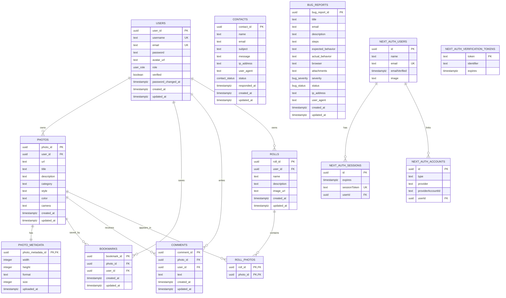

# Entity Relationship Diagram (ERD)

Updated: 2026-05-17

## Scope
This ERD reflects the PostgreSQL + Drizzle model as the canonical and only
supported persistence architecture.

Primary sources:
- `packages/db/schemas/*.ts`
- `packages/db/queries/*.ts`
- `apps/web/src/backend/dtos/*.ts`

## Naming Convention
This diagram uses physical PostgreSQL column names, so fields are shown in
`snake_case`. Application code, DTOs, frontend props, and API contracts use
`camelCase` for the corresponding values.

Example mapping:

| Application field | Database column |
| --- | --- |
| `userId` | `user_id` |
| `photoId` | `photo_id` |
| `avatarUrl` | `avatar_url` |
| `createdAt` | `created_at` |

## Canonical Relational ERD

## Data Policy
- PostgreSQL is the only supported data persistence layer.
- Any non-PostgreSQL persistence layer is out of scope and should not be
  introduced in new work.
- Terminology is standardized as `bookmarks` only.
